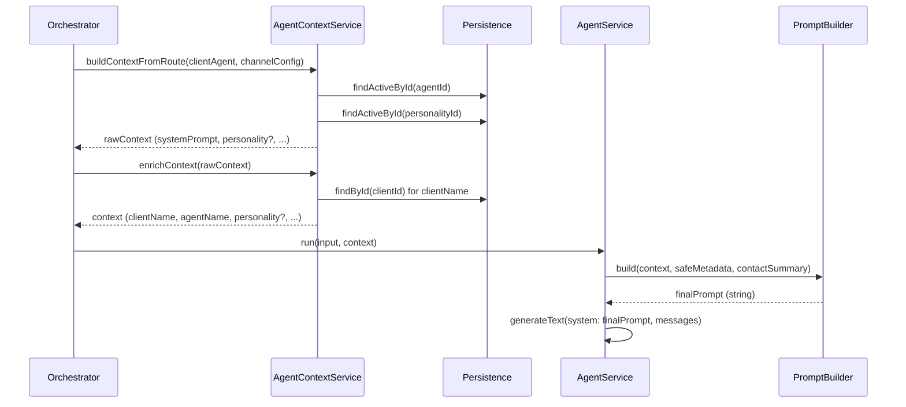
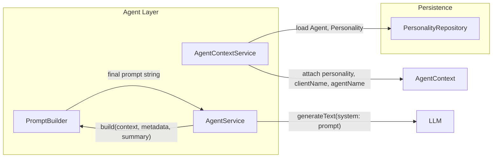

# Agent Personality Feature Plan (Revised)

## Goal

Implement the **Agent Personality feature** while keeping the architecture scalable and avoiding prompt-building logic spreading across services.

- **Personality** is configuration data stored in persistence (structured schema with versioning).
- **Personality affects runtime AI behavior**, so it is applied in the **agent layer**.
- **Prompt construction is centralized and deterministic** in a single service: **PromptBuilder**.
- Layer flow remains: channels → orchestrator → agent → persistence/domain.

---

## Architectural Justification (Mandatory Structural Design Protocol)

### Concern classification

- **Business invariant test**: Personality defines "how this agent should behave" but is catalog/configuration data that drives execution, not pure business truth (e.g. quota, billing period). → **Fail** for domain-only placement.
- **Execution concern test**: Personality is used to build the LLM system prompt (runtime AI behavior, prompt assembly). → **Pass** for **agent layer** for prompt building; **storage** is persistence.
- **Coordination concern test**: No event ordering, idempotency, or conversation resolution. → **Fail** for orchestrator.
- **Storage concern test**: Persistence of personalities and `personalityId` on ClientAgent. → **Pass** for persistence.
- **Transport concern test**: No webhook/HTTP handling. → **Fail** for channels.

**Layer placement**: **Persistence** for Personality schema, repository, and ClientAgent.personalityId. **Agent** for: loading personality in AgentContextService; centralizing prompt construction in PromptBuilder; AgentService delegating to PromptBuilder and calling generateText.

### Alternative layer rejection

- **Domain**: Personality is prompt content and execution configuration, not pure business invariant. Domain must not encode execution or provider-specific behavior.
- **Orchestrator**: Orchestrator must not build prompts; it only builds AgentContext (via AgentContextService) and calls AgentService. No prompt assembly in orchestrator.
- **Channels**: No I/O or transport concern.

### Contract alignment

- **Dependency flow**: Persistence ← Agent (AgentContextService, PromptBuilder does not need to import persistence if it only receives AgentContext). AgentContextService → PersonalityRepository; AgentService → PromptBuilder. No upward or sideways imports.
- **Idempotency / summary**: Unchanged; no change to Phase C or Phase D.
- **Domain purity**: No domain changes.
- **Prompt construction**: Happens **only** inside the agent layer, and **only** inside **PromptBuilder**. AgentService does not build prompts directly.

### Dependency impact

- **Modified layers**: Persistence (Personality schema/repository, ClientAgent.personalityId); Agent (AgentContext contract, AgentContextService, new PromptBuilder, AgentService); feature layer (client-agents, onboarding, DTOs, validation); seed/migration.
- **New dependencies**: AgentContextService → PersonalityRepository; AgentService → PromptBuilder. No dependency direction changes.

---

## Required Architectural Changes

### 1. PromptBuilder service (centralized prompt construction)

Prompt construction is **moved out of AgentService** and centralized in a new service.

**New file**: [src/core/agent/prompt-builder.service.ts](src/core/agent/prompt-builder.service.ts)

**Responsibilities**:

- Build the **final system prompt** string.
- Assemble prompt sections in a **deterministic order**.
- Merge in this order:
  - Agent base `systemPrompt` (agent instructions)
  - Personality prompt (`personality.promptTemplate` if present)
  - Client context (company name, agent role)
  - Contact summary
  - Safe contact metadata
  - Safety rules (e.g. do not imply prior-conversation memory unless in history)

**Interface**:

- Input: `AgentContext`, `safeMetadata: Record<string, unknown>`, `contactSummary?: string`.
- Output: single `string` (the final system prompt).

**Section order** (example final structure):

```
[Agent Instructions]
<agent.systemPrompt>

[Personality]
<context.personality?.promptTemplate if present>

[Client Context]
<client name, agent role, intro instruction>

[Contact Context]
<contact summary, safe metadata, first name if present>

[Safety Rules]
<fixed safety line(s)>
```

AgentService must **no longer construct prompts directly**. Flow:

```
AgentService.run(input, context)
   → safeMetadata = metadataExposureService.extractSafeMetadata(...)
   → finalPrompt = this.promptBuilder.build(context, safeMetadata, input.contactSummary)
   → generateText({ model, system: finalPrompt, messages })
```

### 2. Structured Personality schema

Personality is not only a `description`. Use a structured schema to support future behavior control and versioning.

**Schema** (conceptual):

| Field | Type | Purpose |
|-------|------|--------|
| name | string | Human-readable name |
| description | string | Short description of the personality |
| tone | string | e.g. "friendly", "professional" |
| communicationStyle | string | e.g. "concise", "detailed" |
| examplePhrases | string[] | Optional example phrases |
| guardrails | string | Optional guardrail instructions |
| promptTemplate | string | **Injected into system prompt**; main content for [Personality] section |
| status | enum | active \| inactive \| archived |
| version | number | For safe evolution and reproducibility |
| timestamps | createdAt, updatedAt | Lifecycle |

**Persistence**: [src/core/persistence/schemas/personality.schema.ts](src/core/persistence/schemas/personality.schema.ts)

- Collection: `personalities`.
- Index on `status` for active lookups; optional compound index on `(status, version)` if you query by version.

The field **promptTemplate** is what PromptBuilder uses for the [Personality] section. Other fields (tone, communicationStyle, examplePhrases, guardrails) can be used in the future (e.g. included in promptTemplate at save time, or merged by PromptBuilder from structured data); for this plan, **promptTemplate** is the single source for the personality block in the prompt.

### 3. Personality versioning

- **version**: number (required). Incremented on meaningful changes; allows reproducibility and experimentation.
- **status**: active \| inactive \| archived. Only **active** personalities should be loadable for context (PersonalityRepository.findActiveById or equivalent).

This allows safe evolution of personalities and future A/B or version pinning (e.g. ClientAgent could later reference personalityVersion; for this plan, ClientAgent references personalityId and the repository returns the active document).

### 4. AgentContext extension

Extend the context with a **personality block** (optional).

**Contract** [src/core/agent/contracts/agent-context.ts](src/core/agent/contracts/agent-context.ts):

```ts
AgentContext {
  agentId: string;
  agentName?: string;
  clientId: string;
  clientName?: string;
  channelId: string;
  systemPrompt: string;           // agent base instructions
  personality?: {
    id: string;
    name: string;
    promptTemplate: string;
  };
  llmConfig: { provider; apiKey; model; };
  channelConfig?: Record<string, unknown>;
}
```

AgentContextService loads the personality from persistence and attaches this block; it does **not** build any prompt text.

### 5. AgentContextService responsibilities

**buildContextFromRoute(clientAgent, channelConfig)**:

- Load **Agent** (existing).
- Load **Personality** using `clientAgent.personalityId` (PersonalityRepository.findActiveById or findById; if not found or inactive, leave `context.personality` undefined).
- Build raw context with `systemPrompt: agent.systemPrompt`, and if personality loaded, `personality: { id, name, promptTemplate }`.
- Do **not** build prompts here; only attach data to context.

**enrichContext(context)**:

- Load client (existing); set `clientName` and `agentName` on context for use by **PromptBuilder**.
- Do **not** append client/agent lines to `context.systemPrompt`. Remove the current behavior that mutates `systemPrompt` with client context; client context becomes a section built by PromptBuilder from `context.clientName` and `context.agentName`.

Result: AgentContextService only **loads runtime data** and **attaches personality and client/agent names** to context. Prompt assembly lives only in **PromptBuilder**.

### 6. PromptBuilder behavior

- Receives: `AgentContext`, `safeMetadata: Record<string, unknown>`, `contactSummary?: string`.
- Returns: final system prompt string.
- **Section ordering** (deterministic):
  1. **[Agent Instructions]**: `context.systemPrompt`
  2. **[Personality]**: `context.personality?.promptTemplate` (if present)
  3. **[Client Context]**: lines derived from `context.clientName`, `context.agentName` (e.g. "You are representing …", "Your role is …", intro instruction)
  4. **[Contact Context]**: contact summary, safe metadata, optional first-name greeting line
  5. **[Safety Rules]**: fixed line(s) (e.g. do not imply prior-conversation memory unless in history)

Sections are concatenated with clear delimiters (e.g. `\n\n` or `\n\n---\n\n`). Empty sections are omitted.

### 7. Optional: personality caching

AgentContextService may cache personality lookups by `personalityId` with a short TTL (e.g. 5–10 minutes) to reduce database reads. Implementation options: in-memory Map with expiry, or a small cache module. This is an optimization and does not change the architecture or dependency flow.

---

## Runtime Data Flow



- **Orchestrator**: Does not build prompts; only calls AgentContextService and AgentService.
- **AgentContextService**: Loads Agent and Personality, enriches context with client/agent names; no prompt string building.
- **PromptBuilder**: Single place that assembles the final system prompt from context + metadata + summary.
- **AgentService**: Delegates prompt construction to PromptBuilder; calls LLM with the returned prompt.

---

## Implementation Plan

### 1. Persistence layer

**Personality schema** [src/core/persistence/schemas/personality.schema.ts](src/core/persistence/schemas/personality.schema.ts):

- Collection: `personalities`.
- Fields: `name` (string, required), `description` (string, required), `tone` (string, optional), `communicationStyle` (string, optional), `examplePhrases` (string[], optional), `guardrails` (string, optional), `promptTemplate` (string, required), `status` (enum: active \| inactive \| archived, default active, indexed), `version` (number, required, default 1), timestamps.
- Index: `{ status: 1 }` for active lookups.

**Personality entity** [src/core/persistence/entities/personality.entity.ts](src/core/persistence/entities/personality.entity.ts): Interface matching the schema (id, name, description, tone, communicationStyle, examplePhrases, guardrails, promptTemplate, status, version, createdAt, updatedAt).

**PersonalityRepository** [src/core/persistence/repositories/personality.repository.ts](src/core/persistence/repositories/personality.repository.ts):

- `findById(id: string): Promise<Personality | null>`
- `findActiveById(id: string): Promise<Personality | null>` (status === 'active')

**ClientAgent schema** [src/core/persistence/schemas/client-agent.schema.ts](src/core/persistence/schemas/client-agent.schema.ts): Add `personalityId` (Types.ObjectId, ref 'Personality', required for new hires). Migration/backfill strategy below for existing documents.

**DatabaseModule** [src/core/persistence/database.module.ts](src/core/persistence/database.module.ts): Register Personality schema and PersonalityRepository.

### 2. Agent layer

**PromptBuilder service** [src/core/agent/prompt-builder.service.ts](src/core/agent/prompt-builder.service.ts):

- Injectable; no persistence dependency; receives only AgentContext + safeMetadata + contactSummary.
- Method: `build(context: AgentContext, safeMetadata: Record<string, unknown>, contactSummary?: string): string`.
- Implement section order: [Agent Instructions] → [Personality] → [Client Context] → [Contact Context] → [Safety Rules]. Omit empty sections. Return single string.

**AgentContext** [src/core/agent/contracts/agent-context.ts](src/core/agent/contracts/agent-context.ts): Add optional `personality?: { id: string; name: string; promptTemplate: string }`. Ensure `clientName` and `agentName` remain on context for PromptBuilder.

**AgentContextService** [src/core/agent/agent-context.service.ts](src/core/agent/agent-context.service.ts):

- Inject PersonalityRepository.
- In `buildContextFromRoute`: after loading agent, if `clientAgent.personalityId`, load personality via `findActiveById`. If found, set `rawContext.personality = { id, name, promptTemplate }`. Do not set systemPrompt from personality; keep `systemPrompt: agent.systemPrompt`.
- In `enrichContext`: load client; set `clientName` and `agentName` on context. **Remove** the logic that appends client/agent lines to `context.systemPrompt`; return context with updated clientName/agentName only (systemPrompt unchanged). PromptBuilder will build [Client Context] from these fields.

**AgentService** [src/core/agent/agent.service.ts](src/core/agent/agent.service.ts):

- Inject PromptBuilder.
- In `run`: compute safeMetadata and contactSummary as today; call `finalPrompt = this.promptBuilder.build(context, safeMetadata, input.contactSummary)`; call `generateText({ model, system: finalPrompt, messages })`. Remove private `buildSystemPrompt` and any direct prompt string construction.

**AgentModule** [src/core/agent/agent.module.ts](src/core/agent/agent.module.ts): Register PromptBuilder in providers and ensure it is available to AgentService. AgentContextService needs access to PersonalityRepository (via persistence; AgentModule may need to import DatabaseModule or receive repositories via a shared module that exports them).

### 3. Feature layer

**CreateClientAgentDto** [src/features/client-agents/dto/create-client-agent.dto.ts](src/features/client-agents/dto/create-client-agent.dto.ts): Add `personalityId` (MongoId, required).

**UpdateClientAgentDto** [src/features/client-agents/dto/update-client-agent.dto.ts](src/features/client-agents/dto/update-client-agent.dto.ts): Add optional `personalityId` if updates are allowed.

**ClientAgentsService** [src/features/client-agents/client-agents.service.ts](src/features/client-agents/client-agents.service.ts): On create/update, validate that `personalityId` exists and is active (e.g. via PersonalityRepository or a feature-level PersonalitiesService). Pass `personalityId` into `clientAgentRepository.create` / `update`.

**Onboarding** [src/features/onboarding/dto/register-and-hire.dto.ts](src/features/onboarding/dto/register-and-hire.dto.ts): Add `personalityId` to AgentHiringDto (required). [src/features/onboarding/onboarding.service.ts](src/features/onboarding/onboarding.service.ts): When creating ClientAgent, pass `personalityId` from `dto.agentHiring.personalityId`; validate personality exists (or rely on seed/default).

Optional: **PersonalitiesModule** (controller + service) for CRUD on personalities; not required for prompt-building flow.

### 4. Seed data and migration

**Seed data** [src/core/persistence/data/seed-data.json](src/core/persistence/data/seed-data.json): Add `personalities` array. Example entry: default personality with `name`, `description`, `promptTemplate` (e.g. short neutral instructions), `status: "active"`, `version: 1`. Seed order: create personalities first, then agents, then users/client_agents with both agentId and personalityId.

**SeederService** [src/core/persistence/seeder.service.ts](src/core/persistence/seeder.service.ts): Create Personality documents from seed; when creating ClientAgents (direct or via agentHirings), set `personalityId` to the default (or mapped) personality id.

**Migration/backfill**: If `personalityId` is required and existing `client_agents` exist without it: create a default personality (e.g. "Default") and run a one-time update of all client_agents missing `personalityId` to that id. Alternatively, make `personalityId` optional initially and backfill later, then enforce required in a follow-up.

### 5. Testing impact

- **PromptBuilder**: Unit tests with mock AgentContext (with/without personality, with/without clientName/agentName); assert section order and content.
- **AgentContextService**: Mock PersonalityRepository; assert context.personality is set when personalityId present and personality active; assert enrichContext no longer mutates systemPrompt.
- **AgentService**: Mock PromptBuilder; assert AgentService calls promptBuilder.build(...) and generateText receives the returned string; remove tests that asserted private buildSystemPrompt behavior.
- **E2E / integration**: Client-agents and onboarding flows include personalityId; seed creates default personality and assigns it to seeded ClientAgents.
- **PersonalityRepository**: Optional unit tests for findActiveById.

---

## Constraints Verification

- **Dependency flow**: channels → orchestrator → agent → persistence/domain. No reversal. PromptBuilder is agent-internal and does not import persistence.
- **Orchestrator**: Does not build prompts; only uses AgentContextService and AgentService.
- **Domain**: Unchanged; no new domain types or logic.
- **Prompt construction**: Only inside agent layer, and only inside **PromptBuilder**; AgentService delegates and does not build prompt strings.

---

## Schema Definitions (Reference)

**Personality** (Mongoose):

```ts
{
  name: string;
  description: string;
  tone?: string;
  communicationStyle?: string;
  examplePhrases?: string[];
  guardrails?: string;
  promptTemplate: string;   // used in [Personality] section
  status: 'active' | 'inactive' | 'archived';
  version: number;
  createdAt: Date;
  updatedAt: Date;
}
```

**AgentContext.personality** (in-memory, from persistence):

```ts
personality?: {
  id: string;
  name: string;
  promptTemplate: string;
};
```

**ClientAgent** (add):

```ts
personalityId: Types.ObjectId;  // ref 'Personality'
```

---

## Diagram: Prompt assembly ownership



Prompt construction is centralized in PromptBuilder; AgentContextService only loads and attaches data; AgentService orchestrates and calls the LLM.
